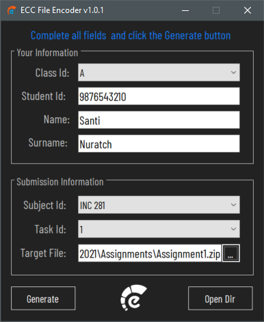

# ECCFileEncoder

---

## File Submission

1 Run the `EccFileEncoder v1.0.1.exe` (Right-click and `Run as administrator`)

2 Complete all Your Information and Submission Information fields.

3 Click the `Generate` button to generate the terget file.

4 Click the `Open Dir` button to open the output directory.

5 Upload the target file to the specified google drive.

---

## Download and Install

1 Download the [ECCFileEncoder](./EccFileEncoder v1.0.1.zip).

2 Extract the file using [7Zip](https://www.7-zip.org/) or another.
